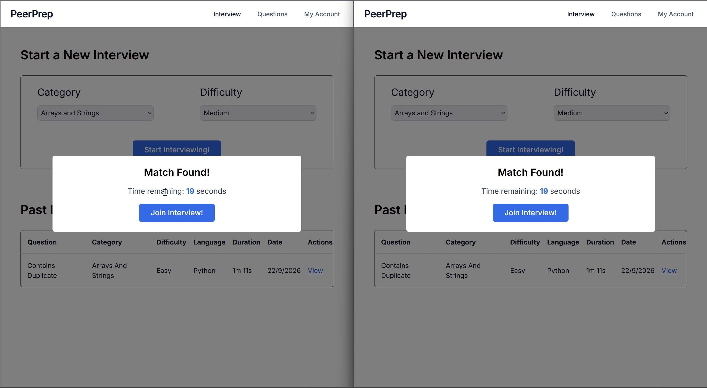
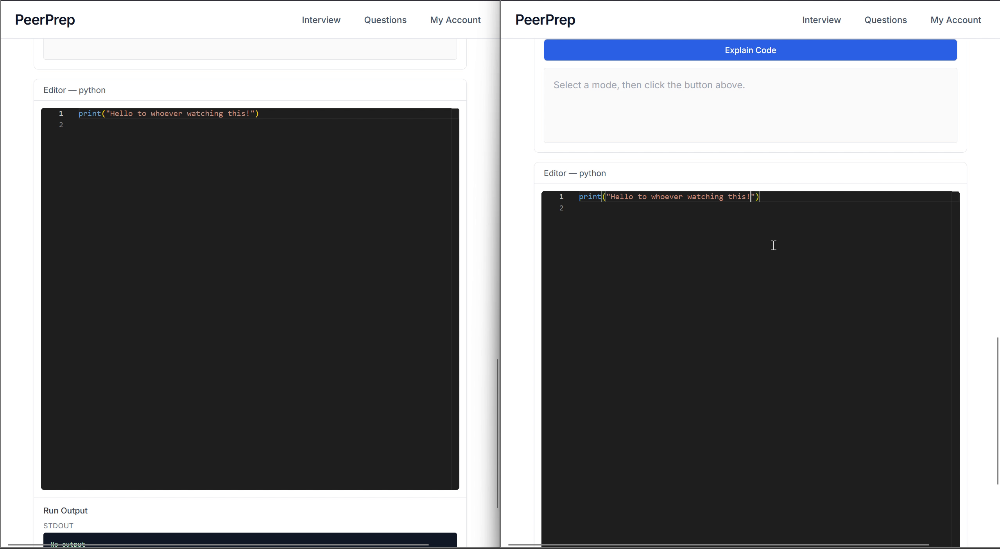
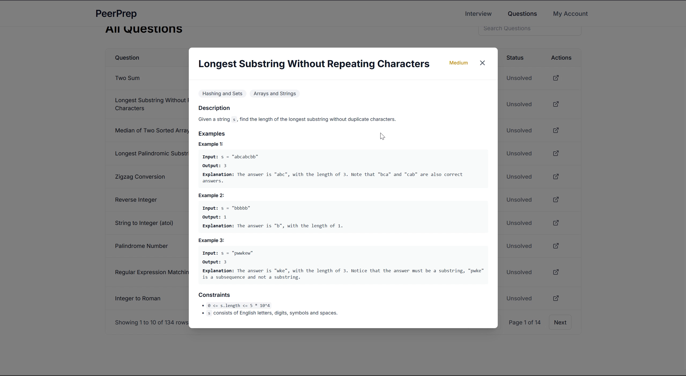

# CS3219 Project (PeerPrep) - AY2526S1 G21

This project is a full-stack collaborative coding platform inspired by the experience of solving problems on LeetCode, but extended with real-time teamwork and AI-powered assistance. It provides an environment where multiple users can simultaneously work on programming challenges, discuss ideas through an integrated chat system, run their code in a secure sandbox, and get generative AI support for hints, debugging, and explanations.

## Demo

Skip the long intros, here's the demo of the platform in action. It showcases matchmaking, collaborative editing, code execution, and AI assistance:

<video controls width="800">
  <source src="docs/media/peerprep-demo.mp4" type="video/mp4">
  Your browser does not support the video tag.
</video>

Question browsing, matchmaking, shared editing, code execution, and session history. Captions included; no audio.

### Find a practice partner



### Code together



### Browse the question bank



## Table of Contents

1. [Platform Overview](#platform-overview)
2. [Service Matrix](#service-matrix)
3. [Repository Layout](#repository-layout)
4. [Prerequisites](#prerequisites)
5. [Environment Configuration](#environment-configuration)
6. [Running the Platform](#running-the-platform)
7. [Observability & Ops](#observability--ops)
8. [Testing & Quality Gates](#testing--quality-gates)
9. [Troubleshooting](#troubleshooting)
10. [Disclaimer on AI Usage](#disclaimer-on-ai-usage)

## Platform Overview

PeerPrep delivers a LeetCode-like experience enhanced with:

- **Collaborative editor** built with React, Monaco, and OT-backed session state so multiple users can edit simultaneously.
- **Matchmaking and session orchestration** that pairs users by difficulty preference and spins up shared rooms.
- **Secure sandbox execution**: solutions are compiled/executed inside containerized sandboxes exposed through a dedicated Go service.
- **Integrated chat & voice** so teammates can talk through approaches while coding.
- **Generative AI assistant** (Gemini) that can provide hints, explanations, and post-session feedback exports.

Everything is decomposed into Go microservices behind lightweight REST/WebSocket APIs and backed by MongoDB, PostgreSQL, Redis, and Dockerized worker nodes.

### Tech Stack

- **Frontend**: React 18 + TypeScript, Vite, TailwindCSS, Monaco editor.
- **Backend services**: Go 1.22–1.24 using chi routers, service-specific logging (zap or stdlib), cron jobs, and Redis/Mongo/Postgres clients.
- **AI integration**: `google.golang.org/genai` + Gemini models, optional fine-tuning pipeline + exporter jobs.
- **Messaging & caching**: Redis for queues/session state, WebSockets for real-time collaboration and signaling.
- **Infrastructure**: Docker Compose for local dev, Prometheus + Grafana for observability, GitHub Actions CI.

## Service Matrix

| Service | Default Port | What it does | Key dependencies |
| --- | --- | --- | --- |
| `user` | 8081 | Auth, profile management, and email notifications | PostgreSQL, Redis, SMTP |
| `question` | 8082 | Question bank CRUD + difficulty filtering | MongoDB |
| `match` | 8083 | Queueing + pairing logic, room provisioning | Redis |
| `collab` | 8084 | Real-time editor, chat, and sandbox orchestration | Redis, Sandbox service, Question service |
| `voice` | 8085 | Voice/WebRTC signaling over WebSockets | Redis |
| `ai` | 8086 | Gemini-backed assistant, feedback exporting/tuning | PostgreSQL, Gemini credentials |
| `sandbox` | 8090 | Docker-based code execution with resource limits | Docker daemon socket |
| `api-gateway` | 80/443 | Optional Nginx reverse proxy for deployment | All backend services |
| `peerprep-frontend` | 5173 (dev) | Vite SPA that consumes all APIs & sockets | Node.js 18+, browser |
| Supporting infra | – | MongoDB 7, Redis 7, PostgreSQL 15, Prometheus, Grafana | Docker volumes |

## Repository Layout

```
.
├── services/                # Go microservices + Nginx gateway
│   ├── ai/                  # AI assistant & feedback jobs
│   ├── collab/              # Code collaboration sessions
│   ├── match/               # Matchmaking queue
│   ├── question/            # Question bank API
│   ├── sandbox/             # Code runner / sandbox daemon
│   ├── user/                # Auth + account management
│   ├── voice/               # Voice signaling service
│   └── api-gateway/         # Nginx config (deployment)
├── peerprep-frontend/       # React + Vite SPA
├── deploy/                  # Docker Compose, seeds, monitoring config
│   ├── docker-compose.yaml
│   └── seeds/               # Mongo + Postgres seed data
├── monitoring/              # Standalone Prometheus/Grafana manifests
├── .github/workflows/       # CI pipeline definitions
├── .env.example             # Shared backend/service env vars
└── README.md
```

## Prerequisites

| Tool | Version | Notes |
| --- | --- | --- |
| Docker Engine + Compose | ≥ 24.x / v2 | Required for full-stack local run and sandbox |
| Go | 1.22+ (collab targets 1.24, AI targets 1.23) | Install locally if running services outside Docker |
| Node.js + npm | Node 18+ | Needed for Vite dev server and frontend builds |
| Make / Bash | Optional | Helpful for scripting; Windows users can use WSL2 or provided `.bat/.ps1` helpers |

For the frontend, Node.js 20 is recommended because the deployment workflow builds with Node 20. Docker Desktop should be running Linux containers on Windows; the sandbox needs access to the Docker daemon.

## Environment Configuration

1. **Backend / Docker Compose**
   ```bash
   cp .env.example .env
   ```
   - Populate database credentials, SMTP config, and AI-related fields. Set `JWT_SECRET` to a long, private value shared by the user, match, collab, and voice services.
   - The current AI service requires `GEMINI_API_KEY`. A Google service account can also be configured for Google Cloud features, but does not replace that key. When using a service account:
     1. Place the downloaded key under `secrets/service-account-key.json`.
     2. Set `GOOGLE_APPLICATION_CREDENTIALS=/secrets/service-account-key.json` inside `.env`.
   - The `load-env.bat` / `load-env.ps1` helpers load AWS credentials from `.env` for deployment tasks; Docker Compose reads `.env` directly.
   - The example SMTP values are placeholders. Use the seeded verified accounts below to explore the app without configuring email.

2. **Frontend**
   ```bash
   cp peerprep-frontend/.env.example peerprep-frontend/.env
   ```
   - Point `VITE_*` URLs to either the Docker Compose ports (`http://localhost:808x`) or deployed load balancers.
   - WebSocket base URLs must use `ws://` (or `wss://`).

3. **Database seeds**
   - Mongo questions: `deploy/seeds/questions.seed.js`
   - Postgres users: `deploy/seeds/users.seed.sql` (creates `test_1` and `test_2`, password `Password123!`).

## Running the Platform

### Option 1: Full stack via Docker Compose

```bash
docker compose -f deploy/docker-compose.yaml up --build
```

Compose starts the backend, datastores, and monitoring services. Run the Vite frontend from Option 2 in a second terminal to open the complete app.

What this gives you:

- User `http://localhost:8081`
- Question `http://localhost:8082`
- Match `http://localhost:8083`
- Collab `http://localhost:8084`
- Voice `http://localhost:8085`
- AI `http://localhost:8086`
- Sandbox `http://localhost:8090`
- Prometheus `http://localhost:9090`
- Grafana `http://localhost:3000`
- Datastores: MongoDB `mongodb://localhost:27017`, Redis `redis://localhost:6379`, Postgres `postgres://localhost:5432`

Seeding (recommended on first run):

```bash
docker compose -f deploy/docker-compose.yaml run --rm mongo-seed
docker compose -f deploy/docker-compose.yaml run --rm postgres-seed
```

Rebuild just one service after code changes:

```bash
docker compose -f deploy/docker-compose.yaml build collab
docker compose -f deploy/docker-compose.yaml up collab -d
```

### Option 2: Frontend only (Vite dev server)

```bash
cd peerprep-frontend
npm install
npm run dev # starts on http://localhost:5173
```

Ensure the `.env` points to running backend endpoints (Docker or remote).

### First-run demo

Open `http://localhost:5173` and sign in as `test_1` or `test_2` with password `Password123!` after seeding. To try matchmaking and the shared editor, use separate browser profiles for the two accounts. AI requests also need a real `GEMINI_API_KEY`; account registration and email flows need working SMTP settings.

## Observability & Ops

- User, question, collab, voice, and sandbox wrap handlers with `internal/metrics`; their endpoints live at `/api/v1/<service>/metrics` (sandbox uses `/metrics`). Match exposes `/api/v1/match/metrics` without the middleware, and the AI service currently has no Prometheus endpoint.
- Prometheus (`deploy/prometheus/prometheus.yml`) defines scrape jobs for user, question, match, collab, voice, and sandbox using their current metrics paths; add an `ai` job if needed.
- Grafana ships with a provisioned **PeerPrep Services Overview** dashboard under `deploy/grafana/`; access via `http://localhost:3000` (admin/admin).
- Add or tweak dashboards by editing `deploy/grafana/dashboards/` and restarting the Grafana container to reload them.
- Logs stream to stdout (zap in user/question, stdlib loggers elsewhere). Inspect with `docker compose logs -f <service>`.

## Testing & Quality Gates

- **Go services**
  ```bash
  cd services/<service>
  go test ./... -cover
  ```
  - CI (`.github/workflows/ci.yml`) runs lint + tests for every service on pushes/PRs and produces per-service coverage badges as workflow artifacts.

- **Frontend**
  ```bash
  cd peerprep-frontend
  npm run build
  ```

- **Container images**
  - GitHub Actions also builds all Docker images (no push) to ensure Dockerfiles stay valid.

## Troubleshooting

| Symptom | Likely cause | Fix |
| --- | --- | --- |
| Sandbox refusing requests | Docker socket not mounted or Docker Desktop not running | Ensure `/var/run/docker.sock` is shared and restart sandbox container |
| `ai` service fails to start | Missing Gemini API key or `GOOGLE_APPLICATION_CREDENTIALS` path | Populate `.env` and mount `secrets/` volume |
| Frontend cannot connect via WebSockets | Using `http://` instead of `ws://` in `.env` | Update `VITE_*_WEBSOCKET_BASE` to `ws://localhost:PORT` |
| Seed scripts exit early | Databases not ready | Rerun `mongo-seed`/`postgres-seed` after `docker compose up` shows Mongo/Postgres healthy |
| Grafana dashboards empty | No traffic yet, or a Prometheus target is down | Check `http://localhost:9090/targets`, then generate a few requests before checking rate panels |

## Disclaimer on AI Usage

AI tools were used in this project to assist with **code autocompletion**, **refactoring**, **code review suggestions**, and **documentation improvements**. All outputs were reviewed and verified by the development team before inclusion.

### Note

- Develop individual microservices within their respective folders to keep boundaries clean.
- Grant the teaching team access to your repository history if requested for dispute resolution.

[](https://classroom.github.com/a/QUdQy4ix)
